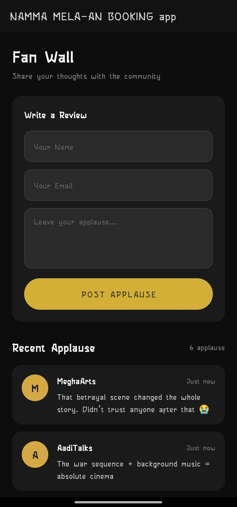

# Namma Mela

## Drama Ticket Booking Android Application

Namma Mela is an Android-based drama and Yakshagana ticket booking application designed to provide users with a modern theatre booking experience.

The application allows users to explore dramas, view cast members, reserve seats, and manage bookings through a clean and visually rich interface inspired by traditional theatre culture.

---

# Features

- Drama ticket booking
- Interactive seat selection
- Seat locking and booking storage
- Drama cast page
- Booking history management
- Drama ratings and details
- Custom drama posters
- Fan wall / applause section
- Modern theatre-inspired UI
- Responsive Android design

---

# Application Screens

## Home Page

- Featured drama section
- Popular actors section
- Recent applause section
- Bottom navigation

## Drama List Page

- Browse all available dramas
- Drama posters and ratings
- Book Seat option
- Cast option

## Seat Booking Page

- Interactive seat layout
- Booked seat protection
- Seat selection highlighting

## Booking History Page

- Stores booked tickets
- Displays drama details
- Shows seat numbers and booking IDs

## Cast Page

- Displays cast cards dynamically
- Random cast order on each open

---

# Tech Stack

## Frontend

- Kotlin
- XML Layouts
- Android SDK
- RecyclerView
- ViewPager2
- Material Design Components

## Storage

- SharedPreferences
- Local Device Storage

## Development Tools

- Android Studio
- Git
- GitHub

---

# UI Design

- Dark theatre-inspired theme
- Gold accent color palette
- Card-based modern layout
- Dynamic drama posters
- Smooth booking interface

---

# Project Structure

```bash
app/
 ├── java/com/srajan/nammamela_anbookingapp/
 │    ├── MainActivity.kt
 │    ├── DramaListActivity.kt
 │    ├── SeatBookingActivity.kt
 │    ├── BookingHistoryActivity.kt
 │    ├── CastActivity.kt
 │    ├── FanWallActivity.kt
 │    └── PaymentActivity.kt
 │
 ├── res/
 │    ├── layout/
 │    ├── drawable/
 │    ├── values/
 │    └── mipmap/
```

---

# Key Functionalities

## Seat Booking System

- Prevents duplicate seat booking
- Stores booked seats locally
- Highlights selected seats visually

## Booking History

- Saves user bookings
- Displays drama name, venue, seats, and amount

## Drama Posters

- Posters loaded from drawable resources
- Each drama supports custom poster images

## Cast Display

- Cast cards shuffle automatically
- Dynamic order every page open

---

# Future Improvements

- Online payment integration
- Firebase backend support
- User authentication system
- QR ticket generation
- Real-time seat synchronization
- Admin dashboard
- Push notifications

---

# Screenshots

## Home Screen


---

## Drama List Page


---

## Seat Booking Page


---

## Cast Page


---

## Booking History Page


---

## Fan Wall Page



---

# GitHub Repository

```bash
https://github.com/SRAJANSHETTY8/Namma-Mela
```

---

# License

This project is created for educational and portfolio purposes.

© 2026 Namma Mela
